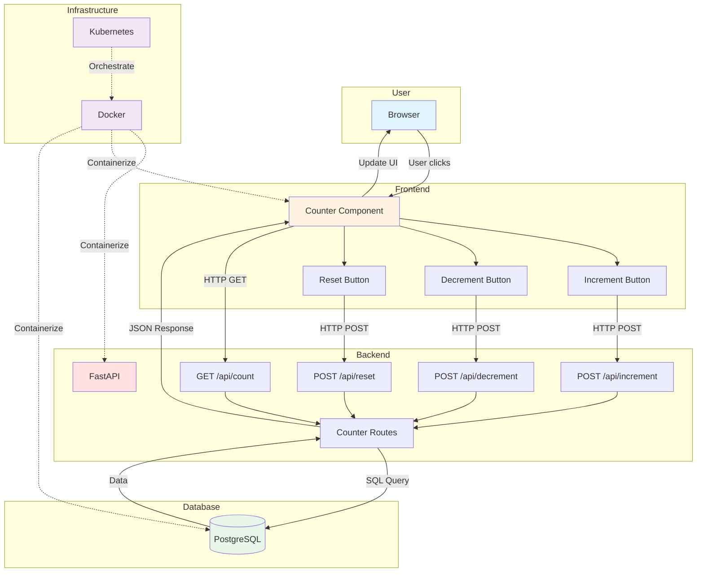

# Counter App – DevOps Practice Project

Jednostavna full-stack aplikacija (React + FastAPI) sa Docker i Kubernetes deployment-om.  
---

## Funkcionalnost

- Prikaz vrednosti brojača
- Dugme za povećanje brojača (+1)
- Dugme za smanjenje brojača (-1)
- Dugme za reset (0)
- Backend čuva stanje i servira podatke preko REST API-ja
- Persistentno čuvanje u PostgreSQL bazi

---

## Tech Stack

- **Frontend:** React + Vite
- **Backend:** FastAPI (Python)
- **Database:** PostgreSQL
- **Containerization:** Docker
- **Orchestration:** Kubernetes (Minikube)
- **IaC:** Terraform (Faza 2)
- **Repo:** GitHub

---

## Plan rada (7 dana)

### **Dan 1-2: Aplikacija**
- Setup projekta (Git repo, folder struktura)
- FastAPI backend sa osnovnim endpoints-ima
- React frontend sa UI za brojač
- Povezivanje backenda i frontenda lokalno

### **Dan 3-4: Dockerizacija**
- Dockerfile za backend, frontend i PostgreSQL
- docker-compose.yml za celu aplikaciju
- Testiranje kontejnerizovane aplikacije lokalno

### **Dan 5-6: Kubernetes (YAML)**
- Kubernetes manifests (Deployments, Services, PVCs, Secrets)
- Deploy na Minikube
- Testiranje i debugging

### **Dan 7: Finalizacija**
- Terraform implementacija
- Dokumentacija
- End-to-end testovi
- Demo

---

## Struktura projekta

counter-app/
├── backend/
│   ├── app/
│   │   ├── init.py
│   │   ├── main.py
│   │   ├── database.py
│   │   ├── models.py
│   │   └── routes/
│   │       ├── init.py
│   │       └── counter.py
│   ├── Dockerfile
│   └── requirements.txt
├── frontend/
│   ├── public/
│   ├── src/
│   │   ├── components/
│   │   │   └── Counter.jsx
│   │   ├── App.jsx
│   │   ├── App.css
│   │   └── main.jsx
│   ├── index.html
│   ├── Dockerfile
│   ├── nginx.conf
│   ├── package.json
│   └── vite.config.js
├── k8s/
│   ├── namespace.yaml
│   ├── secrets.yaml
│   ├── postgres-pvc.yaml
│   ├── postgres-deployment.yaml
│   ├── backend-deployment.yaml
│   └── frontend-deployment.yaml
├── terraform/
├── docker-compose.yml
├── .gitignore
└── README.md

---
## 🏗️ Arhitektura sistema

## Deployment flow

1. **Lokalno:** docker-compose up
2. **Minikube:** kubectl apply -f k8s/
3. **Faza 2:** Terraform za automatizaciju

---

## API Endpoints

- `GET /api/count` - vrati brojač
- `POST /api/increment` - +1
- `POST /api/decrement` - -1
- `POST /api/reset` - resetuj na 0
- `GET /health` - health check

---

## Success criteria

- Aplikacija radi lokalno (docker-compose)
- Uspešan deployment na Minikube
- Brojač persistuje podatke (PostgreSQL)
- Kompletna dokumentacija
- Working demo

---
